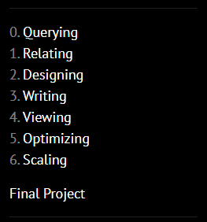
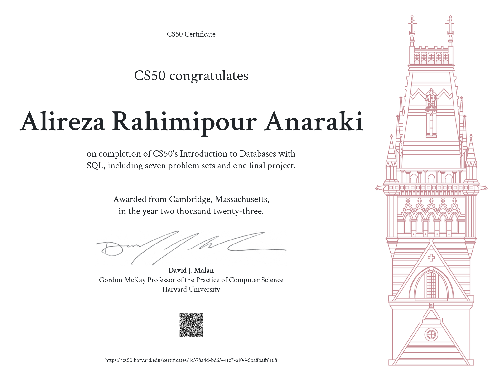

Harvard CS50SQL — 2023 Solutions 😎
=====================

-   [Course Link](https://cs50.harvard.edu/sql/2023/)
-   [My Certificate](https://cs50.harvard.edu/certificates/1c378a4d-bd63-41c7-a106-5ba8baff8168.png?size=letter)
-   [Final Project](https://github.com/alirezarpa/Vocabulary-Manager)

## What is it?

This is CS50’s introduction to databases using a language called SQL. Learn how to create, read, update, and delete data with relational databases, which store data in rows and columns. Learn how to model real-world entities and relationships among them using tables with appropriate types, triggers, and constraints. Learn how to normalize data to eliminate redundancies and reduce potential for errors. Learn how to join tables together using primary and foreign keys. Learn how to automate searches with views and expedite searches with indexes. Learn how to connect SQL with other languages like Python and Java. Course begins with SQLite for portability’s sake and ends with introductions to PostgreSQL and MySQL for scalability’s sake as well. Assignments inspired by real-world datasets.

-   ✅ Videos
-   ✅ Problem Set & Final Project
-   ✅ Slides & Notes
-   ✅ Auto Grader

## Works

This repository is used to store my solutions to weekly assignments. You can click on the folder to see a detailed description of weekly assignments and my achievement.

> A quick word on [Academic Honesty](https://cs50.harvard.edu/x/2022/honesty/). While these solutions will help you to get through the course without too much effort, you should do your best to figure out a working solution yourself before taking a look at any of my solutions. Investing your time and energy into solving the problem sets yourself is in my opinion the only way to eventual mastery.
Go ahead and take a peek at the solutions.

## Table of Contents
- [Problem Set 0: Querying](/Week0)
  * [Cyberchase](/Week0/Cyberchase)
    + [36 Views](/Week0/36-Views)
    + [Normals](/Week0/normals)
  * [Players](/Week0/players)
 - [Problem Set 1: Relating](/Week1)
  * [Packages, Please](/Week1/packages)
  * [DESE](/Week1/DESE)
  * [Moneyball](/Week1/moneyball)
 - [Problem Set 2: Designing](/Week2)
  * [ATL](/Week2/atl)
  * [Happy to Connect](/Week2/connect)
  * [Union Square Donuts](/Week2/donuts)
   - [Problem Set 3: Writing](/Week3)
  * [Don’t Panic!](/Week3/Dont-panic!)
  * [Meteorite Cleaning](/Week3/meteorite)
   - [Problem Set 4: Viewing](/Week4)
  * [Census Taker](/Week4/census)
  * [The Private Eye](/Week4/private)
  * [Bed and Breakfast](/Week4/bnb)
   - [Problem Set 5: Optimizing](/Week5)
  * [your.harvard](/Week5/harvard)
   - [Problem Set 6: Scaling](/Week6)
  * [Happy to Connect (Sentimental)](/Week6/connect)
    + [Don’t Panic! (Sentimental) with Python](/Week6/dont-panic-python)
    + [Don’t Panic! (Sentimental) with Java](/Week6/dont-panic-java)

  

I finished this course on November 20, 2023.
The picture below shows my certificate after completing all the assignments:

# CS50SQL
